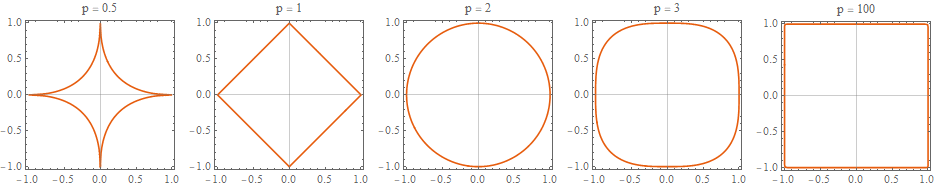

## 실제로 데이터를 이용하여 모델을 만들어보는 챕터
### 사용된 데이터: California census data
### 목표: build a model of housing prices in California

----------
### 먼저 알아야할 사항들 
1. 모델을 만드는 목적이 무엇인지?
    > - how you frame the problem
    > - what algorithms you will select
    > - what performance measure you will use to evaluate your model
    > - how much effort you shouold spend tweaking it
2. What the current solution looks like

### Now ready to start designing your system
1. Frame the problem:
   > - supervised? unsupervised? Reinforcement learning? 
   > - classification? regressing task?
   > - batch learning? online learning?
2. Select a performance measure
   > - typical performance measure for regression: Root Mean Squre Error (RMSE)
   > - if there are many outlier districts: Mean Absolute Error (MAE)
   > - RMSE = Euclidean norm = l2
   > - MAE = Manhattan norm = l1
   > - Norm이 커질수록 더 큰 오차에 집중하게 됨
   

## Exercises

1. Try a Support Vector Machine regressor (sklearn.svm.SVR), with various hyperparameters such as kernel="linear" (with various values for the C hyperparameter) or kernel="rbf" (with various values for the C and gamma hyperparameters). Don’t worry about what these hyperparameters mean for now. How does the best SVR predictor perform?
2. Try replacing GridSearchCV with RandomizedSearchCV.
3. Try adding a transformer in the preparation pipeline to select only the most important attributes.
4. Try creating a single pipeline that does the full data preparation plus the final prediction.
5. Automatically explore some preparation options using GridSearchCV.

## Words
* strata: the population divided into homogeneous subgroups 
* stratum: 