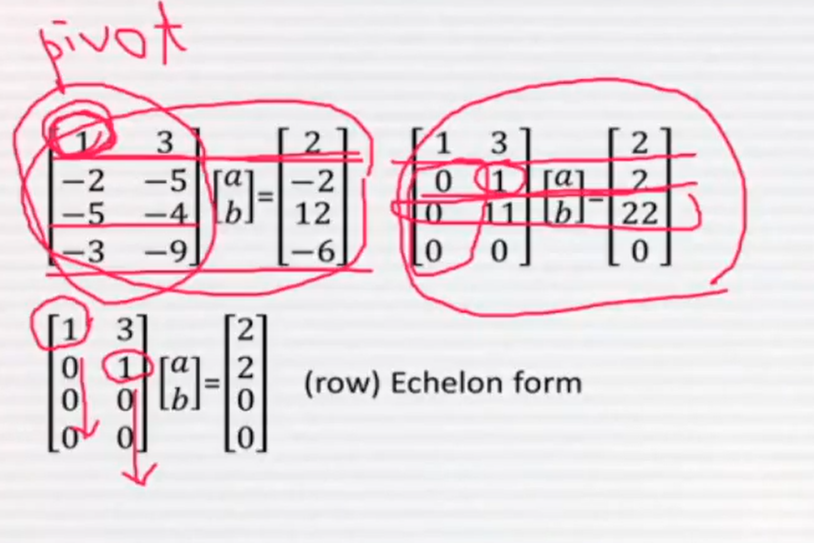

# 3강: Subspace, span, linear independence

## - Thm1.4. Cancellation law
> intersection of subspaces is a subspace

## Linear combination
- $$ Def: v = a_1u_1 + a_2u_2 + ... + a_nu_n $$ 
- v is called a linear combination of  `$ u_1, u_2, ...  `$

## Span
- $$ Def: \emptyset \nsubseteq S \subseteq V  $$
- Span(S) = { All linear combinations of vectors in S}

## - Thm1.5. $$ S \subset V $$ 
> span(S) is a subspace of V

## Linear independence
- Def: S is called linearly  dependent if there exists a finite number of verctors  `$ u_1, u_2, ..., u_n $` in S s.t. a_1u_1 + a_2u_2 + ... + a_nu_n = 0 and at least one of a_1, a_2, ..., a_n != 0