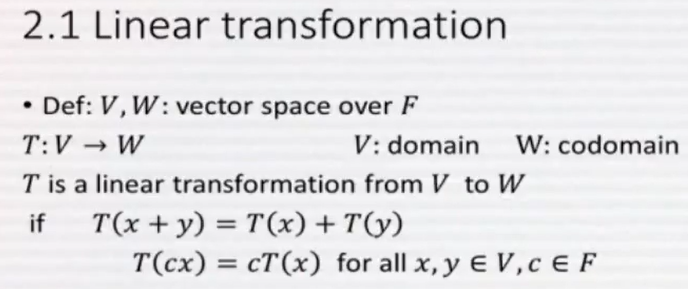

# 5강: Basis, dimension, linear transformation

## Thm 1.11. Dimension of subspace
- V: finite dimensional vector space
- W: a subspace of V
- $$ dim(V) < \infin, W < v \Longrightarrow 1) dim(W) \leq dim(V) \ \ \  2) dim(W) = dim(V) \Longrightarrow V = W $$ 

## Linear transformation
- Def: V, W: vector space over F
